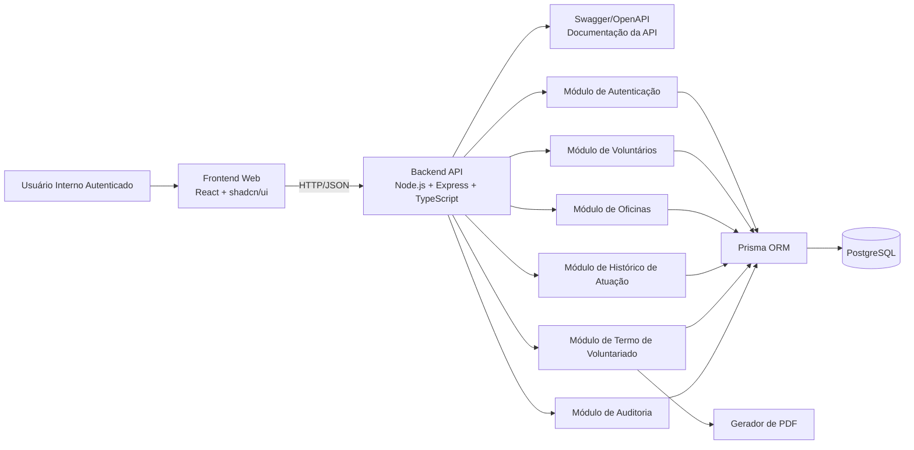
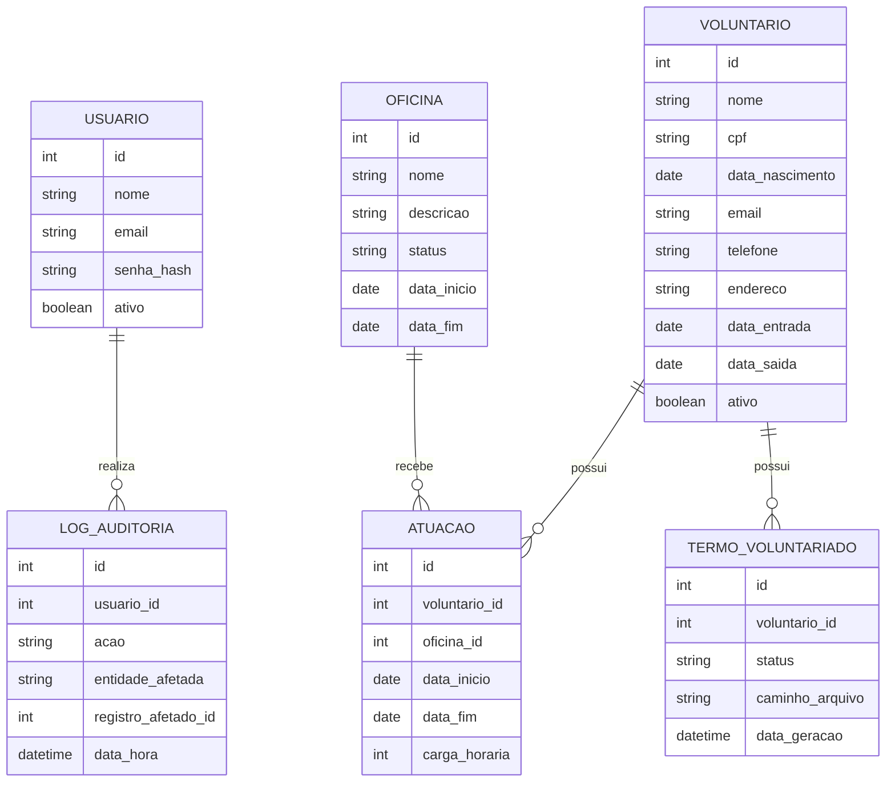

# Arquitetura em Alto Nível - Sistema de Controle de Voluntários do ELLP

**Projeto:** Sistema de Controle de Voluntários do ELLP  
**Disciplina:** Oficina de Integração 2  
**Fase:** Planejamento  
**Etapa:** Definição da Arquitetura em Alto Nível do Sistema  

---

## Sumário

1. [Objetivo da Arquitetura](#1-objetivo-da-arquitetura)
2. [Visão Geral da Solução](#2-visão-geral-da-solução)
3. [Estilo Arquitetural](#3-estilo-arquitetural)
4. [Stack Tecnológica](#4-stack-tecnológica)
5. [Diagrama de Arquitetura em Alto Nível](#5-diagrama-de-arquitetura-em-alto-nível)
6. [Componentes da Arquitetura](#6-componentes-da-arquitetura)
7. [Modelo Conceitual de Dados](#7-modelo-conceitual-de-dados)
8. [Comunicação entre Camadas](#8-comunicação-entre-camadas)
9. [Estrutura Técnica Proposta](#9-estrutura-técnica-proposta)
10. [Decisões Arquiteturais](#10-decisões-arquiteturais)
11. [Limites da Arquitetura Nesta Versão](#11-limites-da-arquitetura-nesta-versão)
12. [Conclusão](#12-conclusão)

---

# 1. Objetivo da Arquitetura

Este documento apresenta a arquitetura em alto nível do Sistema de Controle de Voluntários do ELLP, descrevendo a organização geral da solução, os principais componentes, a separação entre camadas, a stack tecnológica definida e as principais decisões arquiteturais adotadas.

A arquitetura proposta busca manter o sistema organizado, modular, testável e adequado ao desenvolvimento acadêmico durante a disciplina Oficina de Integração 2.

---

# 2. Visão Geral da Solução

O sistema será desenvolvido como uma aplicação web, acessada por navegador, com separação entre frontend, backend e banco de dados.

A solução será composta por:

- frontend web;
- backend com API HTTP;
- banco de dados relacional;
- ORM para acesso aos dados;
- módulo de autenticação;
- módulos de domínio da aplicação;
- serviço de geração de PDF;
- documentação da API com Swagger/OpenAPI.

Nesta versão, o sistema terá autenticação simples, sem diferenciação de perfis de usuário. Todos os usuários autenticados terão o mesmo nível de acesso dentro da aplicação.

---

# 3. Estilo Arquitetural

A arquitetura adotada será um **monolito modular em camadas, inspirado em DDD (Domain-Driven Design)**.

A escolha por DDD tem como objetivo separar melhor as responsabilidades do sistema, mantendo as regras de negócio isoladas de detalhes técnicos como banco de dados, rotas HTTP, frameworks e bibliotecas externas.

Essa abordagem é adequada ao projeto porque o sistema possui entidades de domínio bem definidas, como voluntários, oficinas, atuações, termos de voluntariado e logs de auditoria.

A aplicação será organizada nas seguintes camadas:

## 3.1 Camada de Apresentação / Interface

Responsável pela comunicação com o usuário e pela entrada das requisições no sistema.

No projeto, essa camada será composta por:

- frontend em React;
- componentes visuais com shadcn/ui;
- controllers ou rotas HTTP no backend Express.

Responsabilidades:

- exibir telas da aplicação;
- receber ações do usuário;
- enviar requisições HTTP para o backend;
- receber requisições no backend;
- transformar dados de entrada em chamadas para os casos de uso.

## 3.2 Camada de Aplicação

Responsável por coordenar os casos de uso do sistema.

Essa camada não deve conter detalhes de banco de dados, interface ou bibliotecas externas. Ela deve orquestrar as operações necessárias para atender uma ação do usuário.

Exemplos de casos de uso:

- cadastrar voluntário;
- atualizar voluntário;
- inativar voluntário;
- cadastrar oficina;
- associar voluntário a oficina;
- gerar termo de voluntariado;
- atualizar status do termo.

Responsabilidades:

- coordenar o fluxo das operações;
- chamar regras da camada de domínio;
- acionar repositórios por meio de interfaces;
- retornar resultados para a camada de apresentação.

## 3.3 Camada de Domínio / Negócio

Responsável pelas regras centrais do sistema.

Essa é a camada mais importante da arquitetura, pois concentra o conhecimento do domínio do projeto ELLP.

Elementos previstos:

- entidades de domínio;
- regras de negócio;
- validações de domínio;
- objetos de valor, quando necessário;
- contratos de repositórios.

Exemplos de entidades:

- Voluntário;
- Oficina;
- Atuação;
- Termo de Voluntariado;
- Usuário;
- Log de Auditoria.

Responsabilidades:

- representar os conceitos principais do sistema;
- proteger regras de negócio importantes;
- evitar que regras fiquem espalhadas em controllers ou queries de banco;
- manter o domínio independente de frameworks.

## 3.4 Camada de Infraestrutura / Dados

Responsável pelos detalhes técnicos da aplicação.

No projeto, essa camada será composta por:

- Prisma ORM;
- PostgreSQL;
- implementação dos repositórios;
- geração de PDF com Puppeteer;
- hash de senha com bcrypt;
- autenticação com JWT;
- documentação Swagger/OpenAPI;
- integrações técnicas auxiliares.

Responsabilidades:

- acessar o banco de dados;
- implementar os contratos definidos na camada de domínio;
- executar operações técnicas externas ao domínio;
- isolar detalhes de frameworks e bibliotecas.

## 3.5 Justificativa do Uso de DDD

O uso de uma arquitetura inspirada em DDD contribui para:

- separar regras de negócio dos detalhes técnicos;
- facilitar testes automatizados da camada de domínio e aplicação;
- melhorar a organização do backend;
- reduzir acoplamento entre API, banco de dados e regras do sistema;
- permitir evolução incremental sem comprometer a estrutura do código.

Não será adotado DDD avançado ou excessivamente complexo. A proposta é utilizar uma abordagem simples e prática, compatível com o escopo acadêmico do projeto.

---

# 4. Stack Tecnológica

## 4.1 Frontend

O frontend será desenvolvido com:

- **React**;
- **shadcn/ui**.

Responsabilidades principais do frontend:

- renderizar a interface web;
- exibir formulários, tabelas, filtros e telas de consulta;
- consumir os endpoints disponibilizados pelo backend;
- apresentar mensagens de erro e sucesso ao usuário;
- disponibilizar ações como cadastro, edição, inativação, associação, geração e download de documentos.

## 4.2 Backend

O backend será desenvolvido com:

- **Node.js**;
- **Express**;
- **TypeScript**;
- **Swagger/OpenAPI**, para documentação da API;
- **JWT**, para autenticação baseada em token;
- **Zod**, para validação de dados;
- **bcrypt**, para geração de hash das senhas;
- **Puppeteer**, para geração de arquivos PDF a partir de templates HTML.

Responsabilidades principais do backend:

- disponibilizar a API HTTP da aplicação;
- receber e validar requisições do frontend;
- executar regras de negócio;
- controlar autenticação;
- acessar o banco de dados por meio do Prisma ORM;
- gerar documentos em PDF;
- registrar ações relevantes para auditoria;
- disponibilizar a documentação da API com Swagger/OpenAPI;
- validar dados de entrada com Zod;
- autenticar requisições protegidas com JWT;
- armazenar senhas de forma segura usando bcrypt;
- gerar PDFs utilizando Puppeteer.

## 4.3 Banco de Dados e Persistência

A camada de persistência será composta por:

- **PostgreSQL**;
- **Prisma ORM**.

Responsabilidades principais da persistência:

- armazenar os dados da aplicação;
- representar os relacionamentos entre entidades;
- controlar migrations do banco de dados;
- permitir acesso tipado aos dados por meio do Prisma ORM.

## 4.4 Documentação da API

A documentação da API será feita com:

- **Swagger/OpenAPI**.

A documentação deverá permitir a visualização dos endpoints disponíveis, métodos HTTP, parâmetros esperados, exemplos de requisição, respostas possíveis e códigos de status.

## 4.5 Mapeamento das Tecnologias por Camada

| Camada | Tecnologia |
|---|---|
| Interface web | React |
| Componentes visuais | shadcn/ui |
| API/backend | Node.js + Express |
| Linguagem principal | TypeScript |
| ORM | Prisma ORM |
| Banco de dados | PostgreSQL |
| Documentação da API | Swagger/OpenAPI |
| Comunicação frontend-backend | HTTP/JSON |
| Geração de documentos | Puppeteer |
| Autenticação | JWT |
| Validação de dados | Zod |
| Armazenamento de senhas | bcrypt |

---

# 5. Diagrama de Arquitetura em Alto Nível



---

# 6. Componentes da Arquitetura

## 6.1 Frontend Web

O frontend web será responsável pela interação entre o usuário e o sistema.

Principais responsabilidades:

- disponibilizar telas da aplicação;
- consumir a API do backend;
- enviar dados de formulários;
- exibir listagens e filtros;
- apresentar resultados das operações;
- permitir download de arquivos gerados pelo backend.

## 6.2 Backend / API

O backend será o núcleo da aplicação, responsável por centralizar as operações do sistema.

Principais responsabilidades:

- expor endpoints HTTP;
- validar dados recebidos;
- coordenar chamadas aos módulos internos;
- aplicar regras de negócio;
- acessar o banco de dados via Prisma;
- gerar documentos PDF;
- registrar logs de auditoria;
- fornecer documentação da API.

## 6.3 Módulo de Autenticação

O módulo de autenticação será responsável pelo controle de acesso à aplicação.

Características:

- autenticação por e-mail e senha;
- restrição de acesso a usuários autenticados;
- ausência de perfis de usuário nesta versão;
- mesmo nível de acesso para todos os usuários autenticados.

## 6.4 Módulo de Voluntários

O módulo de voluntários será responsável pelas operações relacionadas aos dados dos voluntários.

Responsabilidades arquiteturais:

- centralizar a lógica relacionada aos voluntários;
- expor serviços internos para cadastro, consulta, atualização e inativação;
- comunicar-se com a camada de persistência;
- integrar-se com os módulos de histórico, termos e auditoria quando necessário.

## 6.5 Módulo de Oficinas

O módulo de oficinas será responsável pelas operações relacionadas às oficinas do projeto.

Responsabilidades arquiteturais:

- centralizar a lógica relacionada às oficinas;
- expor serviços internos para cadastro, consulta, atualização e inativação;
- comunicar-se com a camada de persistência;
- fornecer dados para associação entre voluntários e oficinas.

## 6.6 Módulo de Histórico de Atuação

O módulo de histórico de atuação será responsável por representar os vínculos entre voluntários e oficinas.

Responsabilidades arquiteturais:

- controlar a relação entre voluntários e oficinas;
- armazenar informações de atuação;
- permitir consulta do histórico por voluntário;
- manter os registros disponíveis mesmo após inativação de entidades relacionadas.

## 6.7 Módulo de Termo de Voluntariado

O módulo de termo de voluntariado será responsável pela geração e controle dos documentos em PDF.

Responsabilidades arquiteturais:

- obter dados necessários para preenchimento do termo;
- acionar o serviço de geração de PDF;
- armazenar metadados do documento gerado;
- disponibilizar arquivo para download;
- registrar status do documento.

## 6.8 Serviço de Geração de PDF

O serviço de geração de PDF será utilizado pelo backend para criar o Termo de Adesão ao Trabalho Voluntário.

Responsabilidades arquiteturais:

- receber os dados estruturados do backend;
- aplicar os dados em um modelo padrão de documento;
- gerar arquivo PDF;
- retornar o arquivo ou o caminho de armazenamento ao backend.

A geração de PDF será feita com **Puppeteer**, permitindo criar o termo a partir de um template HTML e convertê-lo para PDF no backend.

Os arquivos PDF gerados terão seu caminho ou referência armazenado no banco de dados, por meio da entidade responsável pelos termos de voluntariado.

## 6.9 Módulo de Auditoria

O módulo de auditoria será responsável por registrar ações relevantes realizadas no sistema.

Responsabilidades arquiteturais:

- receber eventos gerados pelos módulos internos;
- persistir registros de auditoria;
- associar cada ação ao usuário autenticado;
- manter rastreabilidade de operações importantes.

## 6.10 Swagger/OpenAPI

O Swagger/OpenAPI será responsável pela documentação da API.

Responsabilidades arquiteturais:

- documentar endpoints;
- documentar métodos HTTP;
- documentar parâmetros de entrada;
- documentar formatos de resposta;
- auxiliar testes manuais e integração entre frontend e backend.

---

# 7. Modelo Conceitual de Dados

O modelo conceitual abaixo representa as principais entidades previstas para sustentar a arquitetura do sistema.



---

# 8. Comunicação entre Camadas

A comunicação entre frontend e backend será realizada por meio de requisições HTTP, utilizando dados em formato JSON.

O frontend consumirá os endpoints disponibilizados pela API do backend. O backend, por sua vez, acessará o banco de dados por meio do Prisma ORM.

A documentação dos endpoints será disponibilizada por meio do Swagger/OpenAPI.

## 8.1 Padrão de Comunicação

| Origem | Destino | Protocolo/Formato |
|---|---|---|
| Frontend | Backend/API | HTTP + JSON |
| Backend/API | Banco de Dados | Prisma ORM |
| Backend/API | Gerador de PDF | Chamada interna de serviço |
| Backend/API | Swagger/OpenAPI | Documentação dos endpoints |

## 8.2 Exemplos de Endpoints Previstos

Os endpoints abaixo representam uma visão inicial da API e poderão ser ajustados durante a implementação.

```txt
POST   /login
GET    /voluntarios
POST   /voluntarios
PUT    /voluntarios/{id}
PATCH  /voluntarios/{id}/inativar
GET    /oficinas
POST   /oficinas
PUT    /oficinas/{id}
PATCH  /oficinas/{id}/inativar
POST   /voluntarios/{id}/oficinas
GET    /voluntarios/{id}/historico
POST   /voluntarios/{id}/termo
GET    /termos/{id}/download
```

---

# 9. Estrutura Técnica Proposta

A estrutura abaixo representa uma proposta inicial para organização do repositório e separação entre frontend e backend.

```txt
projeto-ellp/
│
├── backend/
│   ├── prisma/
│   │   ├── schema.prisma
│   │   └── migrations/
│   │
│   ├── src/
│   │   ├── domain/
│   │   │   ├── entities/
│   │   │   ├── repositories/
│   │   │   └── value-objects/
│   │   │
│   │   ├── application/
│   │   │   ├── use-cases/
│   │   │   └── dtos/
│   │   │
│   │   ├── infrastructure/
│   │   │   ├── database/
│   │   │   ├── repositories/
│   │   │   ├── auth/
│   │   │   ├── pdf/
│   │   │   └── docs/
│   │   │
│   │   ├── interfaces/
│   │   │   ├── http/
│   │   │   │   ├── controllers/
│   │   │   │   ├── routes/
│   │   │   │   └── middlewares/
│   │   │   └── validations/
│   │   │
│   │   ├── shared/
│   │   │   ├── errors/
│   │   │   └── utils/
│   │   │
│   │   ├── app.ts
│   │   └── server.ts
│   │
│   ├── package.json
│   └── tsconfig.json
│
├── frontend/
│   ├── src/
│   │   ├── components/
│   │   ├── pages/
│   │   ├── services/
│   │   ├── hooks/
│   │   ├── lib/
│   │   └── App.tsx
│   │
│   ├── package.json
│   └── tsconfig.json
│
├── README.md
└── docker-compose.yml
```

---

# 10. Decisões Técnicas Complementares

## 10.1 Estratégia de Autenticação

A autenticação será feita com **JWT**.

Após o login, o backend validará as credenciais do usuário e retornará um token. Esse token será enviado pelo frontend nas requisições autenticadas para permitir o acesso às funcionalidades internas do sistema.

## 10.2 Biblioteca de Geração de PDF

A geração dos documentos PDF será feita com **Puppeteer**.

Essa escolha permite gerar o termo de voluntariado a partir de um template HTML, mantendo maior controle sobre layout, estilos e estrutura visual do documento.

## 10.3 Armazenamento dos PDFs

Os PDFs gerados serão armazenados como caminho ou referência no banco de dados.

O banco de dados não armazenará o conteúdo binário do arquivo PDF, apenas a referência necessária para localização e download posterior do documento.

## 10.4 Validação de Dados

A validação dos dados recebidos pela API será feita com **Zod**.

Os schemas de validação serão utilizados nas rotas ou nos controllers para validar entradas antes da execução das regras de negócio.

## 10.5 Tratamento de Erros

A API utilizará um padrão único de resposta de erro baseado em **Problem Details**.

Esse padrão permite retornar erros de forma consistente, contendo informações como tipo do erro, título, código HTTP, descrição e caminho da requisição.

Formato base:

```json
{
  "type": "https://ellp.local/errors/validation-error",
  "title": "Erro de validação",
  "status": 400,
  "detail": "Um ou mais campos enviados são inválidos.",
  "instance": "/voluntarios",
  "errors": [
    {
      "field": "cpf",
      "message": "CPF é obrigatório."
    }
  ]
}
```

Códigos de erro previstos:

| Situação | Código HTTP | Tipo |
|---|---:|---|
| Erro de validação | 400 | validation-error |
| Credenciais inválidas | 401 | authentication-error |
| Recurso não encontrado | 404 | not-found |
| Conflito de dados | 409 | conflict |
| Erro interno | 500 | internal-server-error |

## 10.6 Documentação Swagger/OpenAPI

A documentação da API será gerada a partir das rotas e controllers.

A documentação deverá refletir os endpoints, parâmetros, schemas de entrada, schemas de resposta, códigos HTTP e exemplos de erro utilizados pela API.

## 10.7 Armazenamento de Senhas

As senhas dos usuários serão armazenadas utilizando **bcrypt** para geração de hash.

O sistema não armazenará senhas em texto puro.

---

# 11. Decisões Arquiteturais

## DA01 - Aplicação Web

O sistema será desenvolvido como uma aplicação web, acessível por navegador.

## DA02 - Monolito Modular com Organização Inspirada em DDD

Será adotado um monolito modular organizado em camadas inspiradas em DDD, separando apresentação, aplicação, domínio e infraestrutura.

## DA03 - Separação entre Frontend e Backend

O sistema terá frontend e backend separados, comunicando-se por meio de API HTTP.

## DA04 - Uso de TypeScript

O TypeScript será utilizado no backend para melhorar organização, legibilidade, manutenção e segurança do código.

## DA05 - Uso de Banco Relacional

O PostgreSQL será utilizado por ser adequado à modelagem de entidades relacionadas e dados estruturados.

## DA06 - Uso do Prisma ORM

O Prisma ORM será utilizado para modelagem das entidades, controle de migrations e acesso aos dados.

## DA07 - Autenticação sem Perfis

O sistema terá autenticação, mas não terá perfis diferentes de usuário nesta versão.

## DA08 - Exclusão Lógica

Registros com histórico associado não serão excluídos permanentemente. A arquitetura deve permitir inativação lógica e preservação dos dados históricos.

## DA09 - Geração de PDF no Backend

A geração do termo de voluntariado será realizada no backend para garantir maior controle, padronização e segurança dos dados utilizados.

## DA10 - Auditoria de Ações Relevantes

O sistema registrará ações relevantes em uma estrutura de auditoria, permitindo rastreabilidade das operações principais.

## DA11 - Documentação da API com Swagger/OpenAPI

A API será documentada com Swagger/OpenAPI para facilitar a consulta dos endpoints, parâmetros, exemplos de uso e integração entre frontend e backend.

## DA12 - Autenticação com JWT

A autenticação será baseada em JWT, permitindo que o frontend envie o token nas requisições protegidas.

## DA13 - Validação com Zod

A validação dos dados de entrada será feita com Zod, mantendo os schemas de validação organizados e compatíveis com TypeScript.

## DA14 - Tratamento Padronizado de Erros

A API utilizará um padrão único de resposta de erro baseado em Problem Details, facilitando tratamento de erros pelo frontend e documentação no Swagger/OpenAPI.

## DA15 - Senhas com bcrypt

As senhas dos usuários serão armazenadas por meio de hash gerado com bcrypt, evitando armazenamento de senhas em texto puro.

## DA16 - PDFs com Puppeteer

A geração dos termos em PDF será realizada com Puppeteer a partir de templates HTML.

## DA17 - Separação entre Domínio e Infraestrutura

As regras de negócio devem ficar na camada de domínio e aplicação, enquanto detalhes técnicos como Prisma ORM, PostgreSQL, JWT, bcrypt, Swagger/OpenAPI e Puppeteer devem permanecer na camada de infraestrutura.

---


